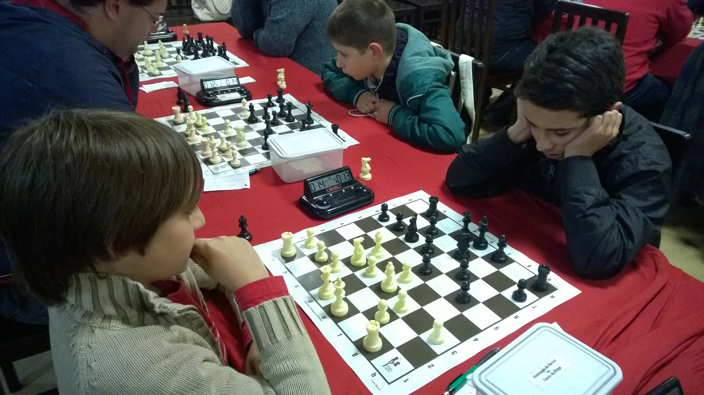
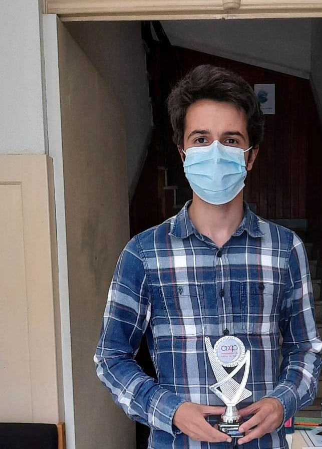
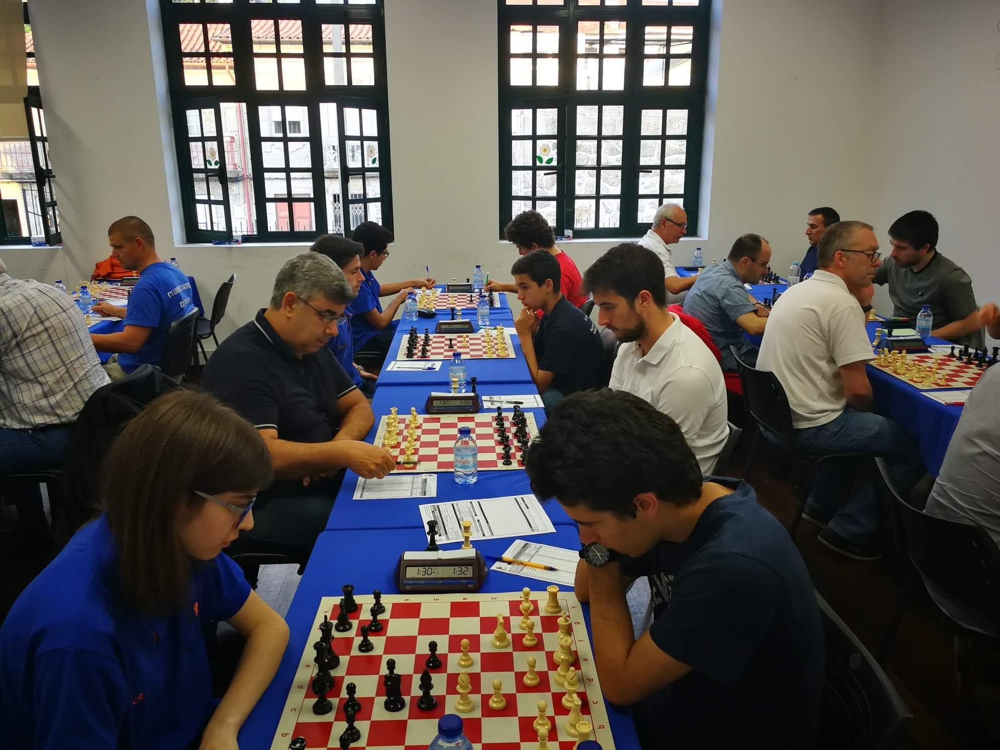

I started playing chess at a very young age.

My father taught me the rules and we used to play using an handmade chessboard we had at home. We were never very good; in fact, we used to hang pieces all the time and play without any structured positional consideration, like every beginner chess player.

I started to win some games in our home disputes and one day, at 13, I showed up in a regional [blitz](https://en.wikipedia.org/wiki/Fast_chess) tournament. It was a very challenging experience, as I had never experienced the rules of over-the-board chess. [J'adoube](https://en.wikipedia.org/wiki/Fast_chess) was something I had never heard and I barely remembered to push the clock after a move. In spite of this, I managed to score 3 out of 7 points. In the world of chess, a win translates to 1 point, a draw to 0.5 points and a loss to 0, so it was not that bad.

*Me at my very first tournament, in Barcelos. My kingside is very weak here, but it was probably left unexploited by my young opponent.*

I was admittedly excited. At the end of the tournament, I was invited by a local club director to join the club's activities, and so my journey as a club chess player began. After some months of attending lessons, I started to gain some positional knowledge and won my very first classical chess games. This was tougher than I expected - I was going against players with much more experience at my age, and my rating was still very low, below 1200. A rough view of the level corresponding to each [Elo](https://en.wikipedia.org/wiki/Elo_rating_system) rating range can be seen below.

| Rating    | Level        |
|-----------|--------------|
| <1200     | Beginner     |
| 1200-1500 | Amateur      |
| 1500-1800 | Club         |
| 1800-2100 | Expert       |
| 2100-2400 | Master       |
| 2400+     | Grand Master |

Playing classical over-the-board chess at big, open tournaments became an habit and I got the chance to play against very good players, including the best players in Portugal.

*As you start to win some games in an open [swiss-based](https://en.wikipedia.org/wiki/Swiss-system_tournament) tournament, you are able to play games in nice wood tables like this one and play against very experienced players, with live online transmission.*

Although open tournaments were an extraordinary opportunity to gain experience, at a young age, chess players are able to compete for titles in junior tournaments - spiritually, the highlight of the year. After playing district championships for some years without much luck, in 2019, after losing my first game and free of pressure, [I won a game against a much higher rated player](/chess/2019-03-03_in%C3%AAs_silva_) and started a streak of winning games to win my first chess title - U18 Braga District Champion. I also had the chance to finish the National School Tournament in the podium later that year.

*The players Felgueiras' High School brought to the 2019 School Regionals.*

The next year saw its tournaments cancelled because of the pandemic. After the competition resumed, in 2021, I won the Porto U20 District Championship in my last year as a junior.

*The beautiful Porto Young District Championship tournament trophy.*

In 2022, no longer a junior, I paused my chess career to focus on college. It was a tough decision to make, given how much I enjoyed to play and teach. I am sure I will return eventually, but until then, chess is alive in my mind.

*Chess is also played in teams. My team João de Meira, from Guimarães, playing against A2D, from Famalicão, in 2018. From bottom to top: me, Nuno Martinho, Orlando Ribeiro and Tomás Monteiro.*
