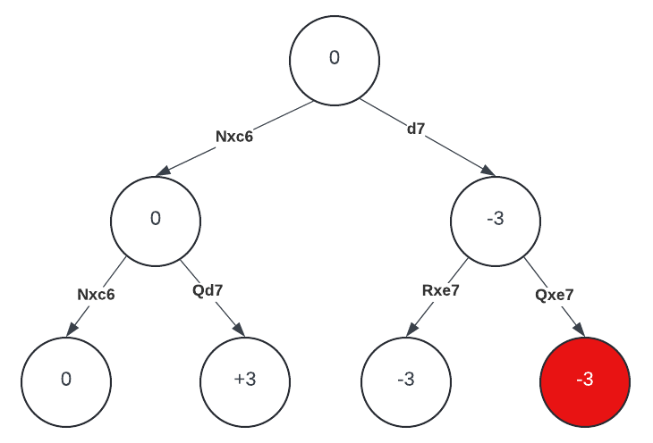

I have developed a Masters-level chess engine. Care to know how it works?

> This article assumes that you know the rules of chess, algebraic notation and understand basic strategic concepts like the importance of material and king safety. If you don't, head to [Lichess](https://lichess.org/learn) and follow along the tutorials. You could also use some [computer science knowledge](https://www.youtube.com/watch?v=CxGSnA-RTsA).

## Motivation

I had some free time in February 2023 and wanted to do something new. I wanted to learn the [Rust programming language](https://www.rust-lang.org/) and was looking for a challenging new project. Since I was already a chess player and was interested in artificial intelligence, it quickly became apparent to me that developing a chess engine was the way to go.

Chess engines are not new in any way. In fact, they go back to the very early days of computing in the 1950s, but only in the late 1990s were they [capable of beating the human world champion](https://en.wikipedia.org/wiki/Deep_Blue_(chess_computer)), due to algorithmic and hardware advancements. Fast forward to now, there is a [lot of literature on the subject](https://www.chessprogramming.org/Main_Page), and [the strongest chess engine in the world](https://stockfishchess.org/) will beat the human world champion 99.997% of the time (based on a 4000 vs 2800 Elo Win Probability calculator from [here](https://wismuth.com/elo/calculator.html#rating1=4000&rating2=2800)).

With this in mind, my goal for [Camel](https://github.com/bdmendes/camel/), my chess engine, was to learn chess programming and have some fun. In spite of that, as of the time of writing, the latest version (1.6.0) is estimated to be around 2200 Elo (in [CCRL](https://computerchess.org.uk/ccrl/404/)), which is actually really good. Let's dive into it!

*A nice camel looking at water. I named the engine Camel in homage to a friend of mine.*

## Board representation and move making

In computer chess a position is typically represented using [FEN](https://www.chessprogramming.org/Forsyth-Edwards_Notation) notation. For instance, the following position is represented as *r2qr2k/1p2N1bp/p1bP1pp1/2P1p3/2Bn4/8/PP1B2PP/2RQ1R1K w - - 4 24*. That might look scary, but if you start at the 8th rank, in White's perspective, you might immediately recognize the pattern: we have a black rook, followed by 2 empty squares, followed by a black queen. */* represent rank changes, and capital letters distinguish white pieces from black pieces. Further along the way, we have *w - - 4 24*, meaning that it is White to move, neither White nor Black can castle, there have been 4 moves without a capture or a pawn push (needed for checking termination via the [50-move rule](https://en.wikipedia.org/wiki/Fifty-move_rule)) and we are in move 24 of the game.

*Example position from a random game I played on Lichess.*

As programmers, all we have to do here is implement a `parse_fen` function that returns a `Position`. However, a `Position` structure might not exactly be designed like you would expect it to. As we need to look into millions of positions per second to be able to find the best moves quicker, move making must be extremely fast. Had we had used a simple 2D array, move making would be extremely costly due to the need of loops e.g. for calculating sliding pieces (bishop, rooks and queens) movements. In fact, the first Camel versions (0.x) used this approach and were about 100x slower than 1.x.

The state-of-the-art board representation is [bitboards](https://www.chessprogramming.org/Bitboards). As most processors nowadays have 64-bit architectures and the chess board has 64 squares, one could argue that that is a match made in heaven. We can represent a chess board by using 8 64-bit variables: 6 for each piece, 1 for White and 1 for Black. In the position above, the rooks bitboard would be 00010001 00000000 00000000 00000000 00000000 00000000 00000000 00100100 and the black pieces bitboard would be 10011001 11000010 01100101 00010000 00001000 00000000 00000000 00000000. Scary enough? Let's look at these with flipped endianness and 8 bits at a time...

    

        
Rooks

        
10001000

        
00000000

        
00000000

        
00000000

        
00000000

        
00000000

        
00000000

        
00100100

    

    

        
Black Pieces

        
10011001

        
01000011

        
10100110

        
00001000

        
00010000

        
00000000

        
00000000

        
00000000

    

        

        
Black Rooks

        
10001000

        
00000000

        
00000000

        
00000000

        
00000000

        
00000000

        
00000000

        
00000000

    

You might have noticed by now that querying the black rooks is a matter of executing the *AND* bitwise operation. Storing the board in this format also allows us to do things like caching the moves for each piece in all squares. For example, knight moves can be stored in 64 64-bit variables, one for each square.

An interesting challenge, though, is caching slider moves, because they depend on the position of other pieces (they cannot jump over them). The state-of-the-art way of caching this is using a perfect hashing technique known as [magic bitboards](https://analog-hors.github.io/site/magic-bitboards/).

## Search

Now that we know how to generate moves, how exactly does our AI's brain work? To put it simply, it uses the [minimax algorithm](https://www.chessprogramming.org/Minimax) with lots of modifications and enhancements.

Minimax sees the game as a tree. Each position is a node, and its children are the available positions after move making. With this in place, the best move is the one that yields the most benefitial position at a leaf node. Minimax gets its name by the fact that a maximizing player tries to maximize the score of a position and the minimizing player tries to minimize it: this is so because a position's score is always in White's perspective.

### Expanding the game tree

Let us see a very small portion of the game tree from the position above, with depth=2. White is the maximizing player and will evaluate two moves: Nxc6 and d7.

*A simplified game search tree for r2qr2k/1p2N1bp/p1bP1pp1/2P1p3/2Bn4/8/PP1B2PP/2RQ1R1K w*

Let's expand Nxc6. Now Black considers Nxc6 and Qd7. Nxc6 restores the material balance, so the evaluation is 0; Qd7 does not recapture the knight and thus White is now up a knight, hence the +3 evaluation. Black is trying to minimize the score, so the parent node will be the minimum of the two, hence 0.

Let's expand d7 now. d7 is immediately refuted by a human player, but a computer does not have intuition and as such will go through all variants (unless pruning happens; we'll look into that shortly after this). Black is now to play and finds two knight captures: by the queen and by the rook. Search stops here and both variants yield advantage for Black (-3), which gets propagated to the parent node.

Now with both variants at depth=1 explored, White prefers Nxc6 as the maximizing player. The initial position is evaluated as 0.

### The need for quiescence search

Notice that I colored the leaf node after Qxe7 in red. This is because, after Qxe7, had we searched a ply (half a move, or a "turn") deeper, with depth=3, we would have found White's promotion with dxe8=Q+, capturing a rook and replacing the pawn with a queen on the board. So, with the previously lost knight, we have *eval=-3+5+9-1=10*. However, the queen is now hanging, and with one ply deeper, we would have concluded the evaluation of the position with a value of +1.

This problem illustrates why we absolutely cannot simply evaluate a position at a leaf node in our game search: there are positions that are not "quiet" and thus their score does not reflect their real potential.

[Quiescence search](https://www.chessprogramming.org/Quiescence_Search) solves this issue by performing a new game search at leaf nodes, this time only analyzing captures (and eventually checks), until all threats are resolved. This makes the search a bit slower but is crucial to avoid catastrophic blunders.

### Alpha-beta pruning and other heuristics

The most classical, lossless pruning technique used in the minimax algorithm is [alpha-beta pruning](https://www.chessprogramming.org/Alpha-Beta). The idea is fairly simple: if one already has found a good move and searches for alternatives, one refutation is enough to avoid them.

In the example above, White finds Nxc6 to yield a position evaluated as 0. Then it goes and evaluates d7, expands into Rxe7 and finds a -3 leaf node. By design, this means that the position after d7 will be evaluated as -3 or less, since Black will choose the minimum score. As we had already found a move yielding an evaluation of 0, which is higher than -3, we can safely abort the expansion of d7, without the risk of losing any meaningful variation. The best scores so far for both sides are stored in variables *alpha* and *beta*.

Since the effectiveness of this pruning technique highly depends on the order of expansion of moves, a good [move ordering](https://www.chessprogramming.org/Move_Ordering) is absolutely vital. As we don't know the best move beforehand, we can use a variety of heuristics for these, such as putting winning captures first ([MVV/LVA](https://www.chessprogramming.org/MVV-LVA)).

Other pruning, reduction and extension techniques are available and might lead to a huge reduction in the branching factor, but possibly losing information. Alpha-beta pruning is one of the few lossless optimizations out there.

## Evaluation

We have been using a simple material evaluation for positions, with pawns evaluated as 1, bishops and knights as 3, rooks as 5 and queens as 9. Although simple, this is not sufficient for a high level play.

The first, easily solvable issue is checkmate. Our evaluation function needs to set the evaluation to +infinite if White has mated the opponent and -infinite if it was Black to do so. What's more, we should also consider how far we are from the tree root and offset these values so that we prefer quicker mates.

However, there is much more to a position than just checkmate and material. An incredibly important concept is activity and space. In the initial position above, material is equal but it is clear to any human observer that White is fairly better: the black king is exposed (there are 2 white pieces attacking g8) and White has a passed pawn.

A decent evaluation function should include bonuses and penalties for piece placements, passed pawns and king attacks. This is however extremely difficult both to code efficiently and generalize. We'll return to this issue in the final section of this article.

## Time management and iterative deepening

The example game search tree we used above had depth=2. We set this arbitrarily for demonstration purposes. Ideally, we would have like to set this to a very high value, to be able to think deeper. However, the goal of a chess engine is to be able to analyze positions quickly, both for game analysis and competition with tight time controls.

When it receives a position with only the remaining player time for the entire game (which is common in bot competitions and human tournaments), the first issue is to assign how much time we want to spend on that position. This is highly subjective, but I use proximity to move 20 and number of moves until move 40 in Camel. Positional considerations are good alternatives that never worked quite well for me.

> You might be wondering why we don't choose a fixed depth instead. That is due to a possible [search explosion](https://www.chessprogramming.org/Search_Explosion) that is very difficult to predict.

After choosing the time to spend, we perform [iterative deepening](https://www.chessprogramming.org/Iterative_Deepening): we search with depth=1, then depth=2, and so on until the time is reached, the current search is aborted and the latest completed search result is returned. Funny enough, performing a iterative deepening search with the same depth as a regular search might be even faster than a single search with that depth, due to the use of [transposition tables](https://www.chessprogramming.org/Transposition_Table) that store results (either exact or bounds) from previous iterations. These require hashing positions efficiently, for example with [zobrist hashing](https://www.chessprogramming.org/Zobrist_Hashing).

## Advanced topics

We looked at only the most important ideas of a classical chess engine. Camel implements all of these and some more, but state-of-the-art engines are much more advanced.

First, the search and evaluation functions are highly optimized in a program like [Stockfish](https://stockfishchess.org/). Due to being able to test all changes in a huge distributed testing framework ([Fishtest](https://tests.stockfishchess.org/tests)), changing factors can be done with confidence. Stockfish source code is indeed full of comments that go into how much Elo a technique proved to be worth.

Even without a huge testing framework, performing games against previous versions served quite well for me. It has shown that applying automated optimizations such as [Texel tuning](https://www.chessprogramming.org/Texel%27s_Tuning_Method) my previously handcrafted evaluation factors has led to a increase in strength of more than 40 Elo points.

In the era of [deep learning](https://www.chessprogramming.org/Deep_Learning), traditional algorithms are quickly getting replaced by huge neural networks that can approximate any function and discover new patterns. In fact, engines such as [Leela](https://www.chessprogramming.org/Leela_Chess_Zero) mostly ditch the traditional search routine and resort to a very large neural network, trained via self-play, for evaluating positions. Even Stockfish, that maintains the full minimax algorithm, uses a neural network (and a highly optimized and incrementally updated one; look at [NNUE](https://www.chessprogramming.org/NNUE)) instead of a traditional evaluation function.

The sky is the limit for a chess engine, and the battle between speed, correctness and innovation is never ending. That is why it is such an extraordinary but tiring task.

## Wrapping up

You can find the [full source code of Camel on my Github](https://github.com/bdmendes/camel/). I hope you found this interesting and are now more interested in developing projects like these or just digging into computing and/or chess in general. Make sure to learn beyond this article and hit me up with your thoughts!

> Update: I gave a talk about this subject at Semana de Informática 2024 @ FEUP. You can find it at [the slides page](/slides).
