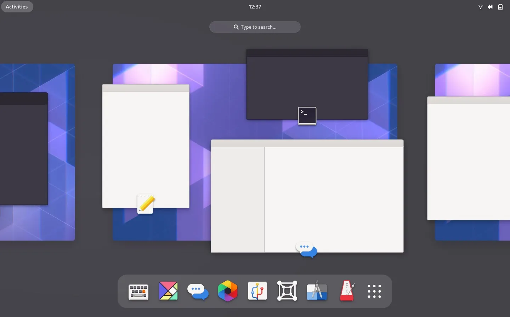
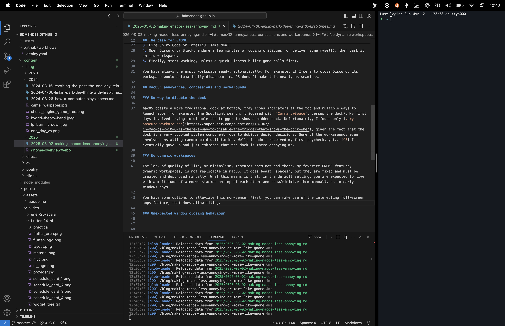

A few months ago, I started working full-time as a Software Engineer, and my company provided me with a high-end Apple MacBook Pro powered by the Apple M3 processor. Without a doubt, it’s the most impressive piece of hardware I’ve ever used. The stunning, crisp display, the exceptional performance and battery efficiency of the ARM-based chip, the spacious and precise trackpad, and the well-balanced weight distribution make it an absolute joy to use. However, macOS has been a different story: it’s given me more than a few headaches.

For years, my personal computers have all run Linux. I first got into it at the start of the pandemic, beginning with Manjaro and [KDE](https://kde.org/) on a friend’s recommendation. A few months later, I decided to dive deeper into the ecosystem and switched to Arch Linux, embracing the hands-on nature of the mainline distro, which surprisingly resulted in less issues than I had with Manjaro. Along the way, I experimented with tiling window managers like i3 for a more automated workflow, but I never quite got used to them[^1]. Eventually, I landed on Fedora with vanilla [GNOME](https://www.gnome.org/), and that’s where I’ve stayed.

So what makes GNOME (in Fedora) so special that it finally ended my distro-hopping journey?

> This article is written at the time of GNOME 47.1 and macOS Sequoia 15.3.

## The case for GNOME

GNOME is a highly opinionated desktop environment (DE) in the GNU/Linux ecosystem. Unlike KDE, which starts with a traditional Windows-like taskbar at the bottom[^2], GNOME features a minimalist top panel with a few status icons, workspace indicators, and the current time. Notably, it lacks a visible list of open windows or a dock at the bottom. This design choice often leads users to install extensions like [Dash to Dock](https://extensions.gnome.org/extension/307/dash-to-dock/) or [Arc Menu](https://extensions.gnome.org/extension/3628/arcmenu/), which alter GNOME's intended workflow[^3].

So, how do you launch and switch applications without a dock or taskbar? Simply press `Super`, select an open app, or start typing and hit `Enter`. For quicker app switching, use `Alt+Tab`. That's it: GNOME keeps application state within the Overview ([referred to internally as the `App Grid`](https://gitlab.gnome.org/GNOME/gnome-shell/-/blob/ae3c36c234a586eb117cfcd6bd60a19bc638eefe/js/ui/overviewControls.js#L27)). No alternative launchers, no extra indicators, just a streamlined, keyboard-centric workflow.

*The GNOME overview, since version 40.*

The most impressive feature of GNOME, for me, is dynamic workspaces. The DE encourages focus by naturally organizing your workflow into separate "rooms", allowing you to concentrate on one or two tasks at a time, as it should[^4]. 

Back in my faculty days, my typical morning routine looked something like this:

1. Open Spotify, queue up some random emo-ish song, and leave it in its own workspace.
2. Launch Firefox and leave it in another.
3. Fire up VS Code or IntelliJ, same deal.
4. Open Discord or Slack, endure a few minutes of coding critiques (or deliver some myself), then park it in its workspace.
5. Finally, start working, unless a quick Lichess bullet game calls first.

You have always one empty workspace ready, automatically. For example, if I were to close Discord, its workspace would automatically disappear. macOS doesn’t make this nearly as seamless.

## macOS: annoyances, concessions and workarounds

### No way to disable the dock

macOS boasts a more traditional dock at bottom, tray icons indicators at the top and multiple ways to launch apps (for example, the Spotlight search, triggered with `Command+Space`, versus the dock). My first days involved trying to disable the trigger to show a hidden dock. Unfortunately, I found only [very obscure workarounds](https://superuser.com/questions/187367/in-mac-os-x-10-6-is-there-a-way-to-disable-the-trigger-that-shows-the-dock-when), given the fact that the dock is a very coupled system component, due to dubious design decisions. Some of the workarounds even involved installing random paid utilitaries. Well, I hadn't received my first paycheck, yet...[^5] I eventually gave up and just embraced the fact that the dock is there annoying me.

### No dynamic workspaces

The lack of quality-of-life, minimalist features does not end there. My favorite GNOME feature, dynamic workspaces, is not replicable in macOS. It does boast "spaces", but they are fixed and must be created and destroyed manually. What this means is that, in the default setting, you are expected to live with a multitude of windows stacked on top of each other and show/minimize them manually as in early Windows days.

You have some options to alleviate this non-sense. First, you can make use of the interesting full-screen apps feature, that does allow tiling, and automatically launches a space for the app.

*As I write this article, I put Visual Studio Code in full-screen mode and a terminal on the right. It looks great, but is not very flexible, as one is not allowed to easily change the combo without recreating it with new windows.*

What I found to work best for me, though, is a feature called [`Stage Manager`](https://support.apple.com/guide/mac-help/use-stage-manager-mchl534ba392/mac). It considers apps as groups, and, unless you group apps explicitly, there is a 1-1 mapping between app and group. At a time, the UI shows applications from a single group, and when you close them, the previous group is summoned. You can drag an app to a group from the hot corner from the left.

In fact, as far as I am concerned, this is dynamic workspaces reinvented, no matter what the marketing is, and I am fine with it.

### Unexpected window closing behaviour

My final annoyance for this article is the inconsistent window closing behaviour. When you hit the red close button in the top left of an app window, what happens depends on the application design. Some applications quit completely, as is the case in other operating systems, but most just *hide* the window and purge progress/state in an ad-hoc basis. In the latter case, the application keeps running, with no open window, and appears on the dock and in the `Command+Tab` switcher. If you are used to keep your computer on at night, as I am, this quickly leads to a mess of "open" ghost applications to switch to.

This macOS way of doing things has, on the other hand, some advantages. Although weird and cumbersome in the perspective of the user, it is actually efficient to keep apps loaded in RAM for them to be launched quickly later. This is also the case in Android, where in newer versions the OS manages open apps quite well and you no longer need to close apps explicitly to improve performance or battery life. With this in mind, my suggestion is for you to ignore the open apps in the dock, and switch to an alternative `Command+Tab` switcher that allows filtering out open apps with no open window. I'm using [`AltTab-MacOS`](https://github.com/lwouis/alt-tab-macos), which is free and open-source, for this purpose.

A more drastic alternative is to have some daemon to automatically kill the apps for you. I'm experimenting with [`Swift Quit`](https://github.com/onebadidea/swiftquit) with ad-hoc exceptions, and have mixed thoughts. Should you want to start it on boot, consider using an [`Automator` script](https://www.macstadium.com/blog/automating-login-and-startup-events-in-macos) to create a `Login Item` for your user that is a shell script.

## Closing thoughts

Apple’s approach to software is highly opinionated, prioritizing experience over customization. macOS lacks the flexibility Linux users expect, often requiring workarounds or adjustments, as presented above. However, with some adaptation, I believe it may become an enjoyable system to use. Ultimately, every OS has strengths and trade-offs, catering to different user needs. In the end, as with many things in life, we learn to adapt, adjust, and find comfort in what works for us.

[^1]: Check out [Tobias Bernard's blog](https://blogs.gnome.org/tbernard/2023/07/26/rethinking-window-management/) for a sound critique of tiling window managers.
[^2]: KDE is designed to be very customizable, but I am now an Apple user, so you should not expect me to tinker with things. (Sarcasm, but I do appreciate a nice out-of-the box design.)
[^3]: Although I use vanilla GNOME, I have no issue with people installing extensions, if it improves their workflow. After all, we are all different and life is too short to be (too) purist. Unfortunately, some GNOME developers [do not share my openness](https://www.reddit.com/r/linuxmasterrace/comments/qk05ll/what_is_the_deal_with_gnome_devs/).
[^4]: The mental cost of context-switching, especially between complex tasks, [is not negligible](https://www.apa.org/topics/research/multitasking).
[^5]: There seems to be a pattern of companies providing paid utilities to fix fundamental flaws of the operating system, which should shame everyone that enjoys computing.
