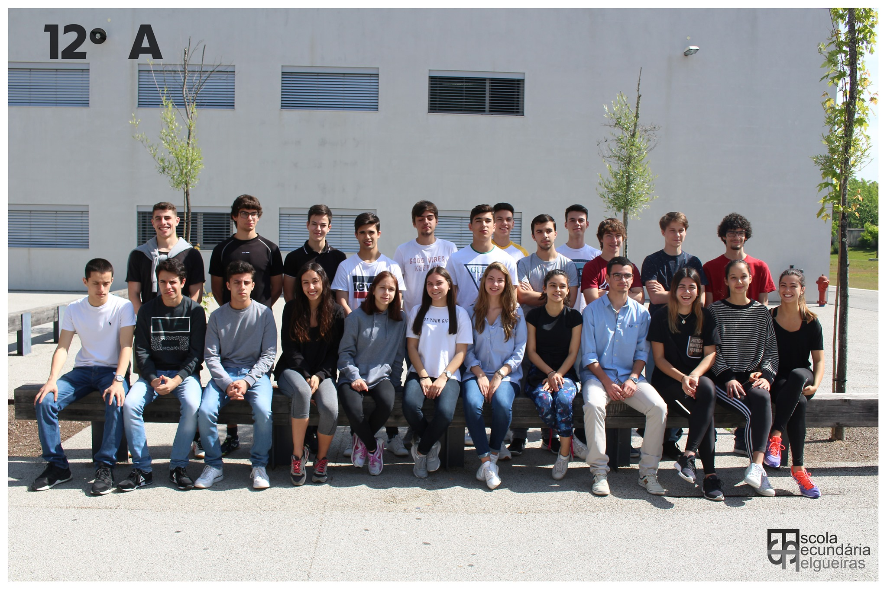

As the first anniversary of my graduation is approaching, I feel now is the time to write a somewhat long article about what I've taken from my life in college. I wanted to do this for a long time now, and the reason for that is twofold: firstly, as time passes, memory fades and text is mostly the best way to preserve it; secondly, what's special must be celebrated, even if for the last time.

I'm originally from Felgueiras, a small city in the Porto district, near Guimarães. Though it has a lot of potential, the city is very much behind in times, partly due to bad decision-making by politics, but also given a tendency of emigration of the most ambitious, in which I proudly put my grandfather who at just 17 went to Angola to fight for a better life. With that in mind, it suffices to say that people are less educated, but also typically more humble and less prone to intrigue arguably caused by the competition in big city centres. This became very clear as I moved to Porto, after high school to join FEUP as an Informatics and Computing Engineering freshman.

*The almost-end-of-year photo of my class in my senior year of High School. I don't remember much of this day, but apparently the sun was making us all very uncomfortable, and half of the students were in the middle of a PE class. Anyway, thanks Facebook and decent search engines.*

I was exactly at the place I wanted to be. The senior year of High School, when we had the opportunity to write some Pascal and Visual Basic code[^api], made it very clear that I wanted to be a Software Engineer. And the faculty of Engineering in Porto, well, was a no-brainer. I had the GPA, family there and a lifelong appreciation for the city. Despite this, the first days were not easy. 

FEUP is huge. My high school was already pretty big, at least compared to my Middle School[^mid-school], but was definitely not 90 square meters. Also, Porto is (was) huge and complicated. I remember calling my great-aunt, who very affectionately welcomed me into her home for the first semester, semi-panicking about which train I had to pick to go to the Dragão stadium, the nearest station to our house. I only saw *Santo Ovídeo* in the plates. "You need to stop in Trindade, go upstairs and exhange line there, you can take any carriage in the direction near the outside of the station", she said calmly. It was great to get come that day and have my dinner prepared as if I was home[^food-aunt].

[^api]: We wrote a *Who Wants to be a Millionare clone* with music and a funny GUI. One random week, well before the delivery date turned out to be my first all-nighter programming. I was excited with the intriguing behavior of the pseudo-random number generator, that for some reason had to be fed with a seed for the questions to be properly shuffled.
[^mid-school]: My middle school was very small, old and had asbestos in the rooftops, which is probably the reason of my complicated personality. Us who moved to high school at the very last moment (the end of the 9th grade) considered it an "airport". And for a public school in a small town, indeed it was; Sá Carneiro would be proud.
[^food-aunt]: I spent my childhood having lunch in my grandmother's house who, who whould have thought, is my great-aunt's sister. They do both cook extraordinarily, and very similarly.