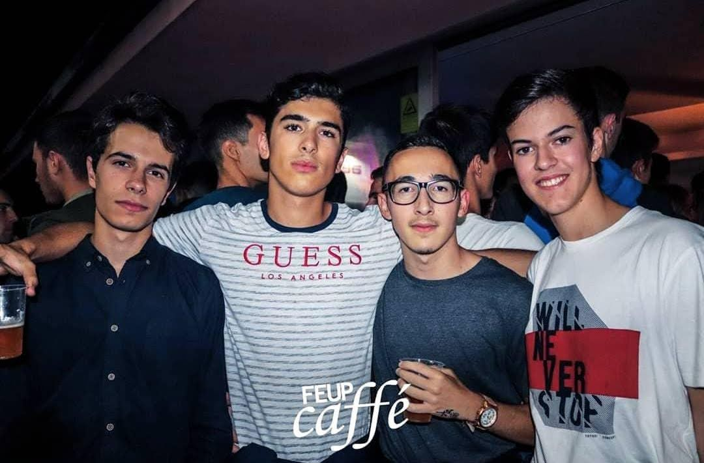
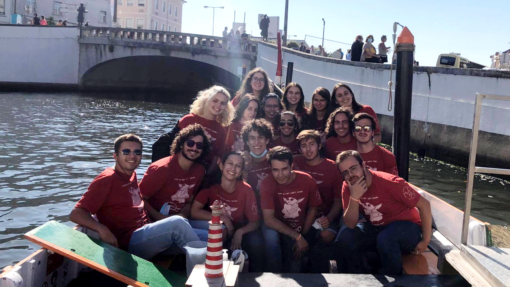
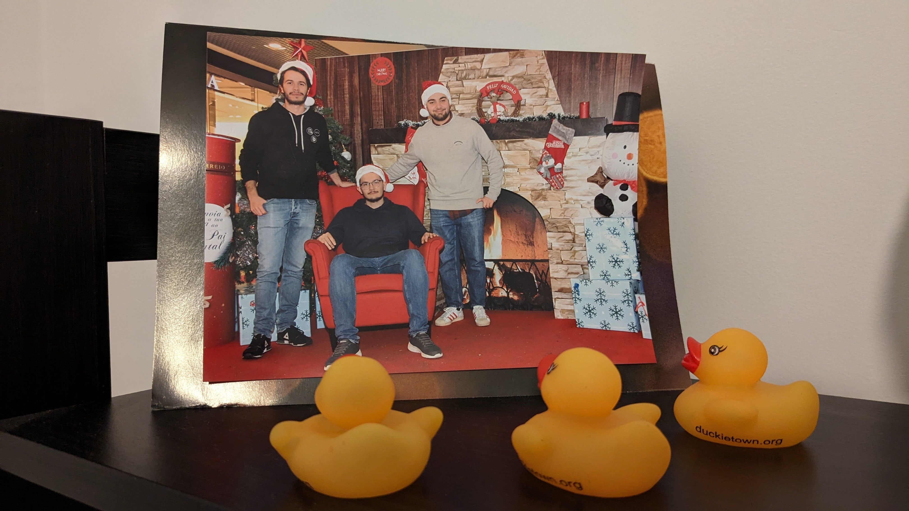
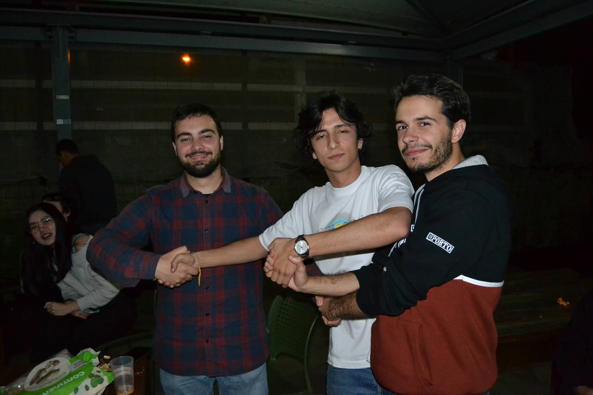
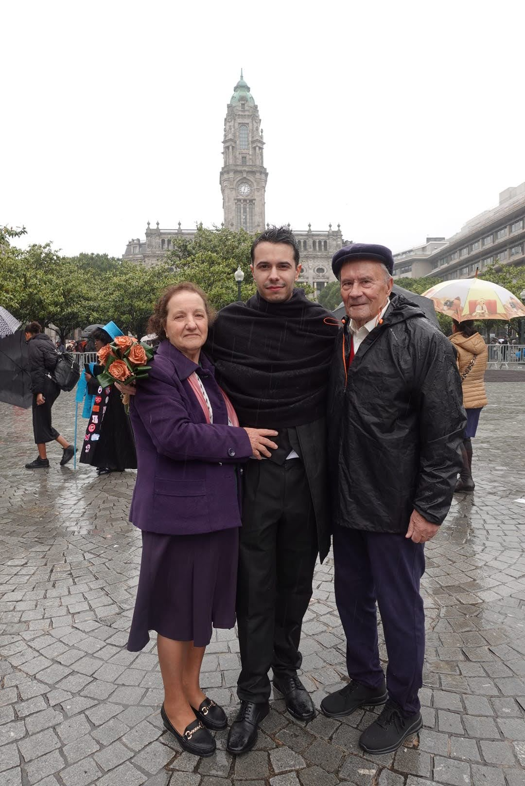
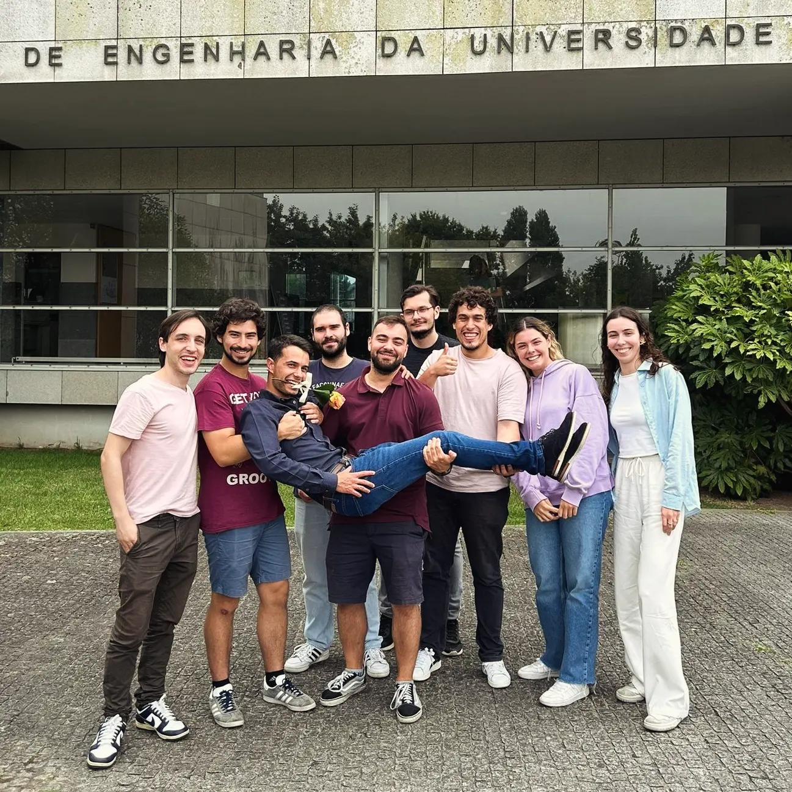

As the first anniversary of my graduation approaches, I feel it’s the perfect time to write a decently-sized article reflecting on what I’ve taken from my college experience. I’ve wanted to do this for a long time, and the reasons are twofold: first, as time passes, memories fade, and writing is one of the best ways to preserve them; second, what is special deserves to be celebrated, even if for the last time, and it should be done without the constraints of social media expectations.

I'm originally from Felgueiras, a small city in the Porto district, near Guimarães. Though it has a lot of potential, the city is very much behind in times, partly due to bad decision-making by politics, but also given a tendency of emigration of the most ambitious, in which I proudly put my grandfather who at just 17 went to Angola to fight for a better life. With that in mind, it suffices to say that people are less educated, but also typically more humble and less prone to intrigue arguably caused by the competition in big city centres. This became very clear as I moved to Porto, after high school to join FEUP as an Informatics and Computing Engineering freshman.

*The almost-end-of-year photo of my class in my senior year of High School. I don't remember much of this day, but apparently the sun was making us all very uncomfortable, and half of the students were in the middle of a PE class. Anyway, thanks Facebook and decent search engines.*

I was exactly at the place I wanted to be. The senior year of High School, when we had the opportunity to write some Pascal and Visual Basic code[^api], made it very clear that I wanted to be a Software Engineer. And the faculty of Engineering in Porto, well, was a no-brainer. I had the GPA, family there and a lifelong appreciation for the city. Despite this, the first days were not easy. 

FEUP is huge. My high school was already pretty big, at least compared to my Middle School[^mid-school], but was definitely not 90 square meters. Also, Porto is (was) huge and complicated. I remember calling my great-aunt, who very affectionately welcomed me into her home for the first semester, semi-panicking about which train I had to pick to go to the Dragão stadium, the nearest station to our house. I only saw *Santo Ovídeo* in the plates. "You need to stop in Trindade, go upstairs and exhange line there, you can take any carriage in the direction near the outside of the station", she said calmly. It was great to come home that day and have dinner prepared as if I was back in my hometown[^food-aunt].

*FeupCaffé is the well-known FEUP party. In the first few iterations, I used to go with my hometown friends. As far as I can recall, I believe this was the very first one I went to.*

Fortunately, I started to make some friends. In Portugal we have *Praxe Académica*, a tradition in which older students mock freshman in groups as they get along[^praxe]. Being sort-of a regular in those activities made things easier. What was weird at first became natural, from social gatherings to group study sessions. It was a completely different experience for me: no longer one of the best but a part of a group, no longer solely invested in achieving decent grades but also in having some fun and enjoying the simple things of life. I still remember studying in a Sunday for a calculus exam with a friend that is now my housemate, being transported in intriguing ways in a vehicle, getting funny nicknames all in a few months.

*There is some tradition involving going to Aveiro, I don't remember why.*

Academically, college is quite different. You're expected to be more autonomous, make the necessary connections between the theory-heavy aspects of a subject and its practical implications, be proactive, and organize yourself. I greatly appreciated this change[^autonomy]; I never liked being closely monitored in high school, nor did I enjoy the rigidity in the way some subjects were taught, which I attributed to a pseudo-pedagogical need to simplify concepts for standardization and accessibility.

Then came Covid. The second semester was just starting, and we were sent home for what we thought would be a few weeks of quarantine. Everything changed: people were gone, back into their hometowns; most classes were suspended, and the remaining turned into awful Zoom sessions[^zoom-covid]. Things stayed like that for almost one year, leaving many people depressed, unmotivated and with serious learning impairments.

Slowly, we returned to in-person classes. At first, this meant biweekly practical lessons, with half the class missing half of the sessions each week. Then, we transitioned to normal practical lessons while theoretical classes remained online. Social events were also making a comeback, but perhaps due to my age, the influence of the lonely months we've had, or both, I found myself less excited about them. Coincidentally, around that time, I moved from my second place in Porto, in São Mamede de Infesta, where I had stayed for only a couple of months, to what would become my longest and most story-filled residence: our house in Areosa.

*(Some of the) Areosa gang in a December. I insisted for paying for this picture, which was a great decision.*

I’d say that the third year, the final year of the Bachelor’s degree[^integrated-bsc-msc], was one of the happiest times of my life. I finally managed to establish a routine that included cooking, sharing a space with others who became very good friends, and balancing my responsibilities. I also had just started dating, and despite all the butterflies, my academic results improved. What's more, I made the difficult decision to pause my chess hobby to focus on what mattered most at the time. This period saw me grow as never before and helped me alleviate some of my worst personality traits. And I'll forever be grateful for that.

Besides my personal and academic pursuits, there was the students' branch, NIAEFEUP. It was an extraordinary place to meet new people and, most importantly, to gain valuable hard and soft skills. At NIAEFEUP, I learned how to design a large-scale application well before that was covered in the curriculum. I also developed skills in team organization, work distribution, discussions about task allocation, and all the meta-work we Software Engineers so thoroughly enjoy, not just in the context of software development[^meta].

*NIAEFEUP organizes a lot of internal and external events, sometimes without much context.*

The next year was a natural continuation of this routine. To be fair, I sometimes find it difficult to appreciate what I have, and looking back I do think I should have taken much more out of this time just by having a more positive outlook. A probable cause for this misterious anxiety was the nearing of the end. Change is never easy, and us having to decide on our dissertation topic forced us to reflect on our future adult lives. Would we all stay friends? Would we find a great job that ultimately made us happy? Or, would we be enslaved by it, and miss on living a fullfilling life?[^future]

The summer after that year, I had the opportunity to intern at a company where I initially thought I’d continue developing my dissertation. Although the parties involved ultimately disagreed on the best way to proceed, I gained valuable insights and met some great people. I then spent my final year largely focused on my dissertation (even with a part-time at the side), at least until our last *Queima das Fitas*, the annual celebration of Porto’s students, which took place around May.

The last Queima was truly special. It was the ultimate celebration of all those years, with family by our side, beautiful events dedicated to our journey, and a profound sense of pride in what we had achieved. That week, I felt, for once, that life had paused just for all of us to enjoy it. Looking to the future, I want to create more moments like that, not only when there’s an agenda to follow. Perhaps that is the most important lesson I took away from college.

*My grandparents insisted on attending this beautiful moment, despite the rain.*

And finally, the Dissertation Defense Day was also very special. With a great audience, to which I'm incredibly grateful for, I've managed to overcome the nerves and deliver a decent presentation which earned me a good grade and ultimately the best way I could have wished for to put an end to these years[^teacher-talk]. They were not perfect, but well, nothing is, and they made us all better people.

*The inevitable Dissertation photo.*

[^api]: We wrote a *Who Wants to be a Millionare clone* with music and a funny GUI. One random week, well before the delivery date turned out to be my first all-nighter programming. I was excited with the intriguing behavior of the pseudo-random number generator, that for some reason had to be fed with a seed for the questions to be properly shuffled.
[^mid-school]: My middle school was very small, old and had asbestos in the rooftops, which is probably the reason of my complicated personality. Us who moved to high school at the very last moment (the end of the 9th grade) considered it an "airport". And for a public school in a small town, indeed it was; Sá Carneiro would be proud.
[^food-aunt]: I spent my childhood having lunch in my grandmother's house who, who whould have thought, is my great-aunt's sister. They do both cook extraordinarily, and very similarly.
[^praxe]: Actually, it's much more profound than that, and what I stated is not the original goal of *Praxe*. But let's not spoil anything here.
[^zoom-covid]: I don't intend to get political or philosophical here, but I'd argue that the unilateral decision of closing schools for 2+ years caused more harm than good, even with all the health considerations to account for.
[^integrated-bsc-msc]: My generation applied for a 5-year Integrated Masters that was in the meantime abolished by the government. As such, we were transitioned to the separated BSc/MSc schema without much choice, but fortunately with automated entry in the MSc. As a sidenote, it was very clear that schools were not prepared for this change, and the MSc ended up not adding much on top of the new, more packed BSc degree.
[^autonomy]: Perhaps a bit too much. I wish I could have had just a little more empathy at that time so as to better handle some conflicts that in retrospective were very unnecessary.
[^future]: I think this a *very* common topic among college students, even if only at their subconscious. The FOMO they/we feel is gigantic, perhaps because we feel that these *must* be the best years of our lives, the place for all the stories, which is honestly quite baffling. Is misery the only option for the future?
[^teacher-talk]: I'm actually still a bit devoted to the faculty. I hosted some talks and gave some lectures, making room for a small time slot in my agenda for giving back to the great place FEUP is. For how long I'll do that, I'm not sure.
[^meta]: Now, is talking about talking a talk?
