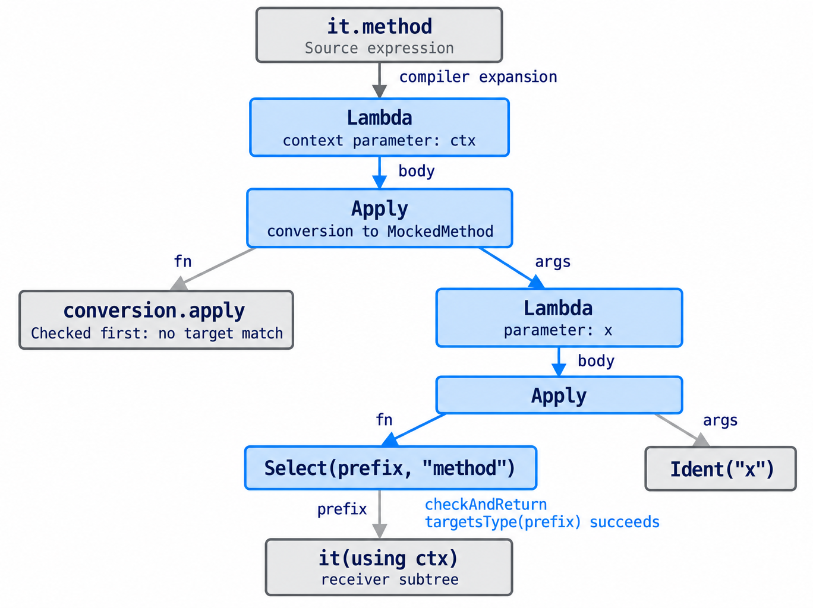

I launched the very first version of [Smockito](https://github.com/bdmendes/smockito) about 15 months ago. It started with a simple premise – it should be extremely straightforward and safe to mock something in Scala. For instance, if one has

```scala
class PaymentService(paymentGateway: PaymentGateway):
  val handle = paymentGateway.authenticate()
  def charge(payment: Payment): PaymentResult = handle.charge(payment)
```

That should suffice for using payment capabilities somewhere in your application, even fake versions for testing. [Back then](/blog/announcing-a-brand-new-project-smockito), I argued that the no-mocking framework alternative – to create something like an `AbstractPaymentService` for easy testing – is needless boilerplate, if for production the implementation is a singular class. This is of course not an universal rule, but was a further reason to try and improve the mocking landscape in Scala.

And so after a few nights fueled with coffee and an idea we could do

```scala
val paymentService = mock[PaymentService]
  .on(it.charge)(_ => PaymentResult.Success)
val controller = PaymentController(paymentService)
controller.charge()
assert(paymentService.times(it.charge) == 1)
```

This exact code still holds in the recently released third major version of Smockito, but some things have changed in the way.


*Another take at the Smockito logo, by our robot friends. But I still very much like the simplicity of the original by my friend [Nuno Costa](https://github.com/biromiro). He handled my "Mockito but merged with the Scala logo" quite well.*

## First pains

I did what I tend to do when trying a new thing that looks good: assumed it is robust, and will work reliably. Having had the chance to test the project in a large project at *$WORK*, it did work, but for the worse or the better, not at all times. Had the semantic versioning police heard of this, I would be in jail.

The first annoyance was related to the type declaration of `Mock[T]`. It started off cool, as an opaque type of `T` and with a companion implicit conversion to it:

```scala
opaque type Mock[T] = T
given Conversion[T, Mock[T]] = identity
```

This is simple and elegant, but falls off in inheritance hierarchies; the compiler does not attempt the conversion at all times. A better solution is to have the capability marker type as in

```scala
opaque type Mock[+T] <: T = T
```

Adding the variance and subtyping annotations solve most issues and make the type behave exactly as one would expect here, a real `T`, but with a marker for extension.

As this was fixed, some people started to find more annoyances. In the 1.x line, I opted to try to track repeated stubbing, like:

```scala
extension [T] (mock: Mock[T])
  def on[A, R](method: Mock[T] ?=> MockedMethod[A,R])(stub: A => R) =
    val answer = Mockito.answer: args =>
      val isStubbingCall = args.forall(_ == null)
      if isStubbingCall then throw RepeatedStubbing
      stub(Tuple.fromArray(args))
    Mockito.doAnswer(answer).when(method(using mock)(anyMatchers))
```

This caught usages like:

```scala
val paymentService = mock[PaymentService]
  .on(it.charge)(_ => PaymentResult.Success)
paymentService.charge(Payment())
paymentService.on(it.charge)(_ => PaymentResult.Failure) // throws
```

As, behing the scenes, Mockito `ArgumentMatcher` are nulls (with side effects at creation time), an already established answer of a method in Scala, a language that does not expect nulls, can assume that if it receives nulls, it's being mocked again. This is ambitious, even if fragile, but most importantly, tries to establish a principle that may not be what all specs want to do. As at *$WORK* we migrated from *scalamock* and/or Mockito to Smockito, some specs made use of repeated stubbing, and changing them to my preferred, single stub style, would introduce further entropy in the migration process.

As such I introduced a trait parameter in the `Smockito` spec:

```scala
enum SmockitoMode:
  case Strict, Relaxed
  
trait Smockito(smockitoMode: SmockitoMode = SmockitoMode.Strict)
```

Allowing users to select the `Relaxed` mode to disable this behavior. And so they did; I started seeing usages of the `Relaxed` mode. The idea was for this to be a migration helper only, but they stood there for days, which was a clear signal that my original idea was too opinionated, and had to go away.

## An heresy along the way

Still in the 1.x line, I introduced a 

```scala
type Pack[A <: Tuple] =
  A match
    case EmptyTuple =>
      Unit
    case Tuple1[h] =>
      h
    case Tuple =>
      A
```

To serve as method arguments instead of a raw tuple. This made usages like:

```scala
val paymentService = mock[PaymentService].on(it.charge):
  case Tuple1(p) if p.valid => PaymentResult.Success
```

Way less annoying and more natural:

```scala
val paymentService = mock[PaymentService].on(it.charge):
  case p if p.valid => PaymentResult.Success
```

This broke existing usages, which technically, as per semantic versioning rules, requires a major version increase[^semantic]. But at this point, I was still convinced I could hold for the 1.x line further.

## So came the breakage

I wanted to revert my repeated stubbing lookup strategy and just make `Relaxed` the only strategy. As a trait parameter is disappearing, at this time, I had really no other choice than to go with Smockito 2. But as we were bumping the version, we also had the chance to introduce further changes.

A rather unsound behavior of Mockito is that it tries to return "smart", emptyish values if a stub that has not been configured is called.

```scala
trait PaymentService(paymentGateway: PaymentGateway):
  val handle = paymentGateway.authenticate()
  def getAllPayments(): List[Payment] = handle.all()

val paymentService = mock[PaymentService]
paymentService.getAllPayments() // *might* return List.empty[Payment]
```

What a smart null would be for the return type in question is heavily arbitrary and based off Java conventions. As `List` here is a Scala type, it is likely that without any syntax adapter[^mockitoscala] this would just return a null and throw in runtime. But, even if `List.empty` was returned, this is sneaky behavior. An empty list is a value as valid as any other, and if a dependency interacts with the mock in a way that it was not configured to respond to, it should fail loudly and present the engineer with a nice error.[^mockito-about-nulls]

Turns out this fitted the existing Smockito API quite well. Smockito controls mock creations via a single method, `mock[T]`, so it could just configure all mocks to use a different default answer:

```scala
object Mock:
  def apply[T](using ct: ClassTag[T]): Mock[T] =
    Mockito.mock(
      ct.runtimeClass.asInstanceOf[Class[T]],
      Mockito.withSettings().defaultAnswer(DefaultAnswer)
    )

object DefaultAnswer extends Answer[Any]:
  override def answer(invocation: InvocationOnMock): Any =
    val method = invocation.getMethod
    if method.getName.contains("$default$") then
      // The Scala compiler synthesizes default arguments as methods.
      try invocation.callRealMethod()
      catch _ => null
    else
      throw UnstubbedMethod(method, invocation.getRawArguments)
```

And so an unexpected call fails and pretty prints the method name and received arguments. There is no need to allow for any other configuration – Smockito is opinionated and as small as possible, and this is sane default. Specs are forced to be explicited, and a test passing earns another interesting semantic property: it now also means that no unexpected interaction with the mock has been made.

## Making it really robust

The 2.x line added some features, like `spy[T]` and `onCall` for per-call stub configuration, but most importantly fixed a lot of Scala quirks. One that comes to mind is how by-named parameters actually desugar in JVM bytecode. I was surprised to learn that in

```scala
def printConditionally(str: => String, iff: Boolean) =
  if iff then println(str)
```

The `str` parameter is represented behind the scenes as a nullary function, `() => String`. This makes sense in the end – experienced Scala developers might know that if a by-name parameter is referenced twice, it is evaluated twice, made evident by its side effects. With this being the case, Smockito needed added special support; a manual eta-expansion to `printConditionally(_: String, _: Boolean)` swallows the by-name nature of the first parameter and would crash the test.

The first release accounting for this behavior did

```scala
def unwrap[A](arguments: Array[Object], index: Int = 0): Array[Object] =
  inline erasedValue[A] match
    case _: EmptyTuple =>
      arguments
    case _: (h *: t) =>
      val unwrapped =
        arguments(index) match
          case f: Function0[?] =>
            inline erasedValue[h] match
              case _: Function0[?] =>
                f
              case _ =>
                f.apply()
          case other =>
            other
      arguments.update(index, unwrapped.asInstanceOf[Object])
      unwrap[t](arguments, index + 1, false)
```

Which essentially means "If I am receiving a nullary function but my signature expects otherwise, try to call it and cast the result to my expected type". This was cool, but can you tell where this falls off?

<details>
  <summary>Why runtime reflection fails</summary>
  
  If your stub parameter is a by-name nullary function, the received value will be a `() => () => R`, which is also a nullary function. This makes the above tentative not work at all times, and calls off for a stronger approach.
  
</details>

## The method accessor sanity macro (and the AI story)

One way to solve all Scala/JVM mismatch quirkiness once and for all[^hope] is to pull runtime work to the compile time. `it.method` is an expression that we can analyse in compile time via a macro; in Scala 3, macros are completely typed and with a stable API, and once can traverse the annotated AST, find a `Select` node, match the type of its application, and the method associated with it for full parameter and return type matching.

The macro API is incredibly powerful, but difficult to use and learn. A regular software engineering job – one not focused in compiler internals or programming languages – is unlikely to require these skills often, and mine is not an exception. Here comes the force of AI – provided with examples of methods whose invalid usages I'd like to detect, an extensive hand-written spec for the library behavior that it is not allowed to touch, only conform to, it only had to write out the idea for me. It generated a rough skeleton of what an accessor sanity macro should look like, and then I had enough to refine it by hand.[^ai-handwrite]


*How the compiler descends through a method expression AST every time you use `on`, `times` or `calls`. It goes through the implicit conversion of a function to `MockedMethod`, finds a `Select` node and then extracts relevant metadata.*

At the end, we're able to very beautifully detect misusages at *compile time*:

```scala
|    trait Printer[A]
|    trait Foo:
|      def describe(upper: Boolean)(using Printer[String]): String
|
|    given Printer[String] = ???
|
|    val invalidFoo = mock[Foo].on(it.describe)(_ => "foo")
|                     ^^^^^^^^^^^^^^^^^^^^^^^^^^^^^^^^^^^^^
|Method describe in Foo expects (Boolean, Printer[String])
|but received function expects (Boolean)
```

## The newest release, and what the future looks like

I updated Smockito to the new Scala 3.9 LTS in the latest 3.0 release, essentially stating that maintaining old LTS versions is a non-goal of this thin wrapper. After all these months, the goal is the same: to be small, provide an opinionated, modern and safe API for mocking with an established runtime engine. I'm not looking to provide compatibility layers, support X or Y framework syntax, and add much more features.

The 3.0 release made the stub arguments a named tuple, whose names are extracted from an augmented method accessor sanity macro:

```scala
assert(repository.calls(it.getWith).map(_.startsWith) == List("john"))
```

Which looks almost like magic, but is the natural continuation of the compile time work started in 2.x. This was also aided by an agent – I had it try off multiple solutions, it broke the project multiple times, but I had then a clear path for internal migration. I implemented by hand each of the relevant ideas, and the final `transparent inline` addition to `on` and `onCall` turned out to be simple in the end, with all the infrastructure laid out.

One thing I am particulary interested in trying is [native refined types](https://scaladays.org/session/first-class-logical-refinement-types-for-scala/), which will allow classifying the number of calls in a more precise way than `Int`. Right now, we need to depend on some library, which is a line I will not cross in Smockito. The native implementation might take some years, though.

I would also like to get rid of the `Smockito` trait and rely on a wildcard import, but the compiler, at the time of writing, struggles with finding imported mock extensions if they collide with one's testing framework names, for instance `times` which has a similarly named counterpart in *specs2*.

Smockito – which now [has a microsite](https://smockito.bdmendes.com), hosted in this domain via a Github Pages deployment in the Smockito's repo CI – was (and is) an incredibly fun learning experience, and the end result is something I am positive adds value. Specs look cool, are easy to read and more predictable than with mocking alternatives. It's just that some tradeoffs had to be made along the way.

Now time to rest and enjoy Autumn.

[^semantic]: What the rules say: starting from version 1, in a schema of X.Y.Z, where X is the major, Y is the minor and Z is the patch, one increases the patch for bug fixes, the minor for added capabilities, and the major for breaking existing usages. In the case of Smockito, it would have been wise to start off with a 0.x line, while it was being tested in the real world, but back we are at the already said thoughts.

[^mockitoscala]: Here mainly referring to *Mockito Scala*, an almost 1 to 1 adaptation of the Mockito API to Scala, that in the said case would correctly return `List.empty`.

[^mockito-about-nulls]: This is me talking. Mockito advocates that a stub whose return value does not matter in the tested scenario should not need to be configured, which is defendable. In Scala, though, this is arguably not a very good principle. If functions are pure enough, all return values of called methods are important, which defeats this argument.

[^hope]: In a world where arguments and dreams do surpass their inevitable limitations, or so to say, their intrinsic failure to generalize.

[^ai-handwrite]: This is how I most like to use AI agents for actually important code. I delegate very focused tasks, review every line and retouch by hand. Another strategy, when trying new things, is to give it a goal and have it implement it end to end – but inevitably throw it away in the end. I want to see the prototype and grasp the idea, not introduce something I do not understand in the codebase with multiple decisions made for me along the way.
