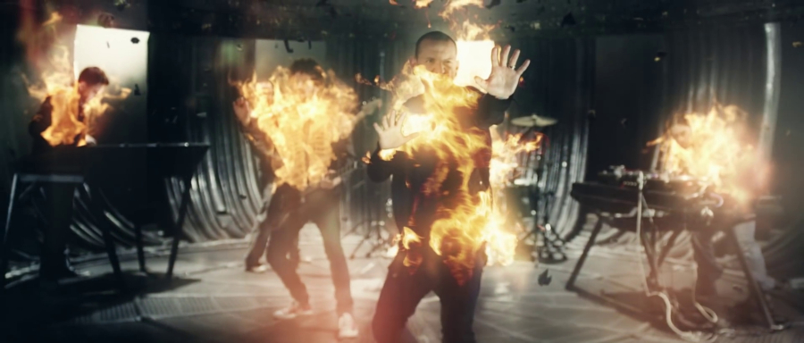
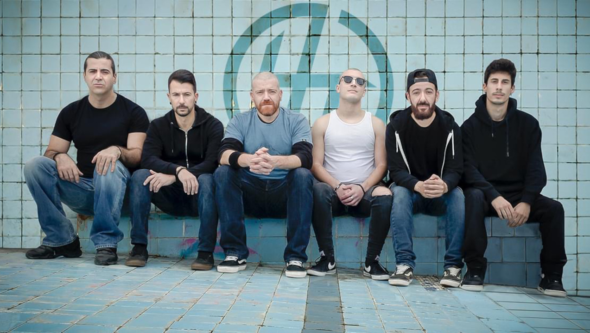

Early 2013. The 11-year-old me was coming home from school and heard *Burn It Down* on the radio, and was hooked instantly.

As an emerging teenager, unmoved by top-charting pop songs, the electronic rock sound of *Burn It Down*, coupled with Chester's soft but raspy voice, was the first time I was interested in music. While my father already jammed quite loudly back home to great artists such as Barclay James Harvest or Pink Floyd, they were never very interesting to me. After all, they were my father's favorites, not mine.

These Linkin Park guys, on the other hand, I'd never heard of. The single was new and fresh and the lyrics were memorable and relatable. Over the years I went on to discover their entire discography and devour all the lyrics as if I would be asked for them. They became an escape when I most needed them and the matter of most of my shower karaokes.

*Chester Bennington in the Burn It Down music video.*

However, Linkin Park may not be the best band ever. They released two genre-shaping albums, *Hybrid Theory* and *Meteora*, in 2000 and 2003, and spent the remaining time of their career, until Chester sadly took his own life in 2017, experimenting with multiple sounds and arguably never quite matching the aura of the original nu-metal atmosphere. Some critics refer to their music as "angsty", or "formulaic" teen music. Why is it then that no other band felt as amazing for me, for several years, despite my listening to other genres more?

It turns out that this phenomenon is not related to music at all. [Researchers at MIT](https://www.businessinsider.com/smartest-age-for-everything-math-vocabulary-memory-2017-7) found that at around 18 we reach peak brain processing power and recollect memories with more detail. [Other studies](https://bigthink.com/neuropsych/psychological-first-love/) show that a "first love" tends to linger throughout life, triggering strong emotions of nostalgia like no other. It's the first instance of an addiction, an extraordinary new thing, at a time when the brain is still developing.

*It seems that some fellow Portuguese millennials felt the same as me and formed the remarkable tribute band Hybrid Theory.*

With that said, it is still quite unclear to me whether lyrics like *You try to take the best of me. Go away!* are cheesy or great. Perhaps I'll never find the answer, and, honestly, it's not that important.

<iframe style="border-radius:12px; max-width: 400px; margin-top:2em; margin-bottom: 0.75em;" src="https://open.spotify.com/embed/playlist/5HNFfj9IbPIOROGX2vsYnY?utm_source=generator" width="100%" height="500" frameBorder="0" allowfullscreen="" allow="autoplay; clipboard-write; encrypted-media; fullscreen; picture-in-picture" loading="lazy"></iframe>

It is hard to fit all of one's favorites from a band in a cohesive album, but that shouldn't stop one from trying.
